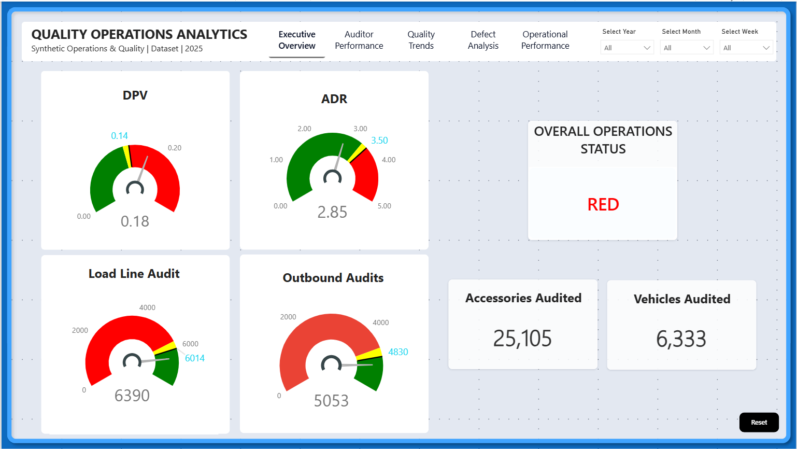
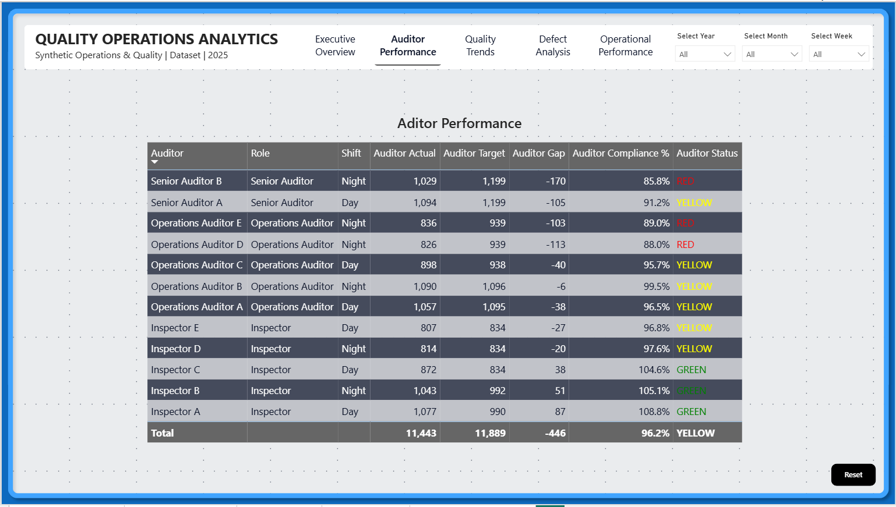
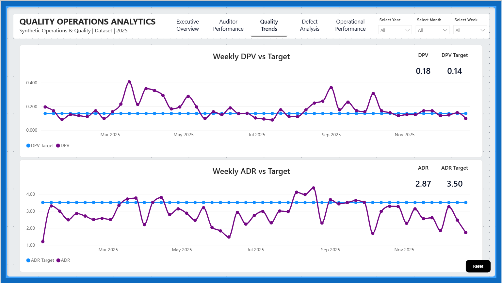
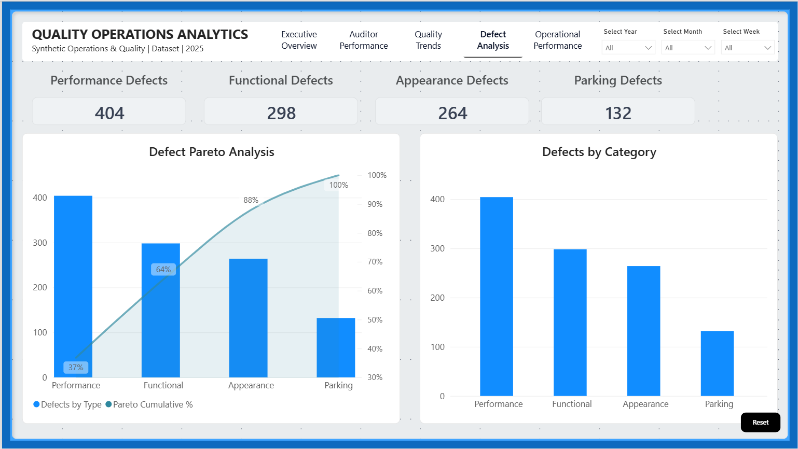
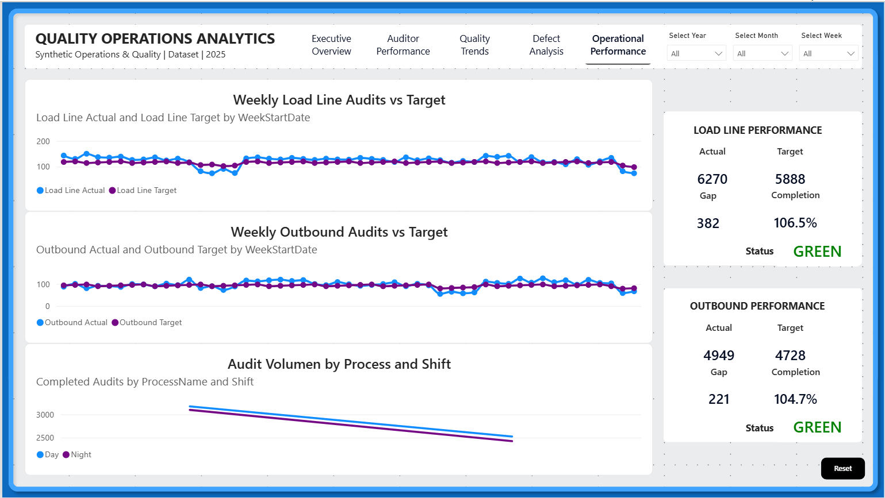

# Quality Operations Analytics | Power BI Portfolio Case Study

A five-page Power BI case study that combines quality defects, audit compliance, operational targets, trend analysis, and Pareto prioritization in one decision-oriented reporting experience.

> **Portfolio disclaimer:** This repository uses synthetic/anonymized data created for demonstration. It contains no real employee, customer, supplier, facility, or confidential operational data. The case study is inspired by common real-world quality and operations analytics workflows, not by a publishable copy of an internal company dashboard.


### Portable local data path
The PBIP expects the bundled workbook at `C:\qoa_portfolio\data\quality_operations_synthetic.xlsx` for a clean, user-independent local path.

## Business problem

Quality and operations teams often review defect performance, auditor execution, and operational throughput in separate reports. This project brings those signals together so leaders can answer four questions quickly:

1. Are quality KPIs meeting target?
2. Are auditors completing the expected workload?
3. Which defect categories should be prioritized first?
4. Are operational audit volumes meeting their context-sensitive targets?

## Dashboard pages

| Page | Purpose |
|---|---|
| Executive Overview | Executive snapshot of DPV, ADR, Load Line, Outbound, overall status, vehicles and accessories audited. |
| Auditor Performance | Auditor-level actual vs target, gap, compliance percentage and status. |
| Quality Trends | Weekly DPV and ADR trends against fixed targets. |
| Defect Analysis | Defect-category KPIs, distribution and dynamic Pareto analysis. |
| Operational Performance | Weekly Load Line/Outbound performance against dynamic targets plus process/shift audit volume. |

## KPI design

- **DPV (Defects per Vehicle)** = Total Defects / Vehicles Audited. Target = **0.14**. Lower is better.
- **ADR (Accessory Defect Rate)** = Accessory Defects / Accessories Audited × 100. Target = **3.50**. Lower is better.
- **Load Line Completion %** = Load Line Actual / Load Line Target.
- **Outbound Completion %** = Outbound Actual / Outbound Target.
- Operational targets are filtered by time context and the corresponding process metric.
- Status colors are reserved for performance state: green, yellow and red.

## Data model

The semantic model follows a dimensional/star-schema pattern:

- Dimensions: `Dim_Date`, `Dim_Auditor`, `Dim_Process`, `Dim_DefectType`
- Facts: `Fact_QualityAudits`, `Fact_OperationalAudits`, `Fact_OperationalTargets`
- Measures: `_Measures`

See [`docs/model_overview.md`](docs/model_overview.md), [`docs/data_dictionary.md`](docs/data_dictionary.md), and [`docs/dax_measures.md`](docs/dax_measures.md).

## Dataset

The included workbook is synthetic and covers calendar year **2025**. The validated baseline contains:

- 365 date rows
- 12 synthetic auditors
- 3 processes
- 6,333 quality-audit rows
- 11,443 operational-audit rows
- 848 operational-target rows

## Validated baseline

With global filters reset to All, the desktop-validated report reconciles to:

| KPI | Value |
|---|---:|
| Vehicles Audited | 6,333 |
| Accessories Audited | 25,105 |
| DPV | 0.18 |
| DPV Target | 0.14 |
| ADR | 2.85 |
| ADR Target | 3.50 |
| Load Line Actual | 6,390 |
| Load Line Target | 6,014 |
| Outbound Actual | 5,053 |
| Outbound Target | 4,830 |

The Defect Analysis and Operational Performance pages intentionally exclude partial weeks for their full-week analytical views.

## Design system

- Canvas: `#EEF3FF`
- Panels: `#FFFFFF`
- Primary blue: `#1478F2`
- Dark navy: `#162A8A`
- Primary text: `#2F2F2F`
- Secondary text: `#6B7280`
- Borders: `#DDE5F0`
- Green / Yellow / Red only for status and exceptions
- Typeface: Segoe UI

The report uses a compact tab-style page navigator, synchronized Year/Month/Week slicers, white analytical panels and a consistent executive header.

## How to open

1. Clone or download the repository.
2. Open `powerbi/Quality_Operations_Analytics_1.pbip` in a Power BI Desktop version that supports PBIP/TMDL.
3. The development master was validated in Power BI Desktop using the original local Excel source path. If the source path is unavailable on your machine, use **Transform data > Data source settings** (or Power Query) to point the workbook source to `data/quality_operations_synthetic.xlsx`.
4. Refresh the model and verify the QA checklist in `docs/qa_and_release_checklist.md`.

Do not edit report definition files externally merely to change visual formatting; the final visual changes for this case study were saved and validated from Power BI Desktop.

## Tools and skills demonstrated

Power BI Desktop · PBIP · TMDL · Power Query (M) · DAX · dimensional modeling · star schema · KPI design · conditional status logic · dynamic targets · synchronized slicers · Pareto analysis · quality analytics · operational analytics · data reconciliation · dashboard UX/UI · data storytelling · documentation · Git/GitHub portfolio packaging.

## Key analytical takeaways

At the full-year baseline, DPV is above its 0.14 target while ADR is below its 3.50 target. Operational audit volumes exceed their overall targets. The defect Pareto concentrates the largest share of defects in Performance, Functional and Appearance categories, supporting prioritized continuous-improvement work rather than treating all defect categories equally.

## Limitations

- Synthetic data is designed to demonstrate analytical behavior, not reproduce a real operating environment.
- Operational/quality definitions are case-study definitions and should not be interpreted as an external industry standard.
- The source workbook is local-file based; a production implementation would normally use governed enterprise sources and deployment-specific parameters.
- Custom visuals may require installation/approval in another Power BI environment.

## Repository structure

```text
quality-operations-analytics-powerbi/
├── README.md
├── LICENSE
├── .gitignore
├── powerbi/
├── data/
├── theme/
├── images/
└── docs/
```

## Author / case study

**Quality Operations Analytics Portfolio**  
BTN Insights: https://btninsights.blogspot.com/  
LinkedIn: https://www.linkedin.com/in/marinmanuel

## Dashboard gallery

### Executive Overview


Executive health view combining fixed quality targets, dynamic operational targets, audited volume and overall status.

### Auditor Performance


Auditor-level actual versus target, gap, compliance and status for workload accountability.

### Quality Trends


Weekly DPV and ADR trends against fixed targets. This analytical page uses completed-week context, so its aggregate ADR can differ slightly from the all-record Executive Overview baseline.

### Defect Analysis


Defect-category KPIs and Pareto prioritization. The three largest categories account for 88% of defects in the full-week analytical baseline.

### Operational Performance


Weekly Load Line and Outbound performance against context-sensitive targets, plus audit volume by process and shift.
